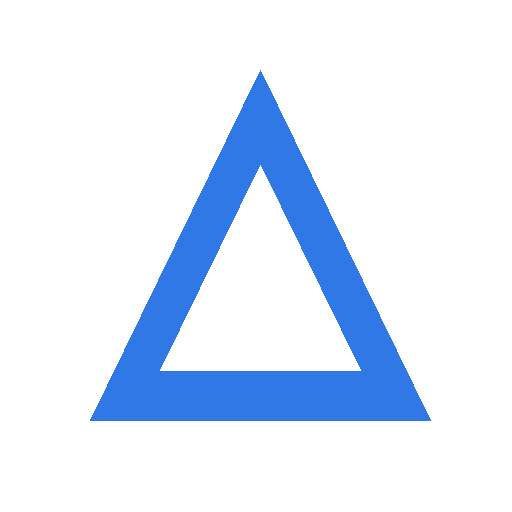

# DOCX-010 large synthetic document

# Large Synthetic Document

## Section 1

Section 1 narrative for Workflow Automation product Nimbus Workflow status=blocked id=SEC-8967-78.

- List item A section 1

- List item B section 1

## Section 2

Section 2 narrative for Service Performance product Atlas Portal status=resolved id=SEC-2610-99.

- List item A section 2

- List item B section 2

## Section 3

Section 3 narrative for Platform Reliability product Northwind Console status=resolved id=SEC-5001-43.

- List item A section 3

- List item B section 3

## Section 4

Section 4 narrative for Knowledge Operations product Nimbus Workflow status=open id=SEC-4029-44.

- List item A section 4

- List item B section 4

## Section 5

Section 5 narrative for Platform Reliability product Blue Harbor Service status=review id=SEC-2182-72.

- List item A section 5

- List item B section 5

| Metric | Value | Status |
| --- | --- | --- |
| Queue | 379 | blocked |

## Section 6

Section 6 narrative for Platform Reliability product Blue Harbor Service status=resolved id=SEC-8530-59.

- List item A section 6

- List item B section 6

## Section 7

Section 7 narrative for Knowledge Operations product Northwind Console status=review id=SEC-9668-61.

- List item A section 7

- List item B section 7

## Section 8

Section 8 narrative for Platform Reliability product Blue Harbor Service status=resolved id=SEC-7441-35.

- List item A section 8

- List item B section 8

## Section 9

Section 9 narrative for Service Performance product Nimbus Workflow status=in\_progress id=SEC-5650-65.

- List item A section 9

- List item B section 9

## Section 10

Section 10 narrative for Knowledge Operations product Nimbus Workflow status=open id=SEC-3285-11.

- List item A section 10

- List item B section 10

| Metric | Value | Status |
| --- | --- | --- |
| Queue | 477 | open |

## Section 11

Section 11 narrative for Workflow Automation product Nimbus Workflow status=review id=SEC-2914-24.

- List item A section 11

- List item B section 11

## Section 12

Section 12 narrative for Service Performance product Northwind Console status=review id=SEC-8762-10.

- List item A section 12

- List item B section 12

## Section 13

Section 13 narrative for Knowledge Operations product Nimbus Workflow status=review id=SEC-5501-93.

- List item A section 13

- List item B section 13

## Section 14

Section 14 narrative for Platform Reliability product Nimbus Workflow status=blocked id=SEC-8425-51.

- List item A section 14

- List item B section 14

## Section 15

Section 15 narrative for Workflow Automation product Blue Harbor Service status=resolved id=SEC-8061-39.

- List item A section 15

- List item B section 15

| Metric | Value | Status |
| --- | --- | --- |
| Queue | 898 | blocked |

## Section 16

Section 16 narrative for Service Performance product Blue Harbor Service status=open id=SEC-9339-52.

- List item A section 16

- List item B section 16

## Section 17

Section 17 narrative for Platform Reliability product Atlas Portal status=review id=SEC-1320-19.

- List item A section 17

- List item B section 17

## Section 18

Section 18 narrative for Service Performance product Blue Harbor Service status=resolved id=SEC-6746-22.

- List item A section 18

- List item B section 18

## Section 19

Section 19 narrative for Workflow Automation product Atlas Portal status=resolved id=SEC-7475-96.

- List item A section 19

- List item B section 19

## Section 20

Section 20 narrative for Knowledge Operations product Atlas Portal status=resolved id=SEC-2818-98.

- List item A section 20

- List item B section 20

| Metric | Value | Status |
| --- | --- | --- |
| Queue | 946 | in_progress |

## Section 21

Section 21 narrative for Platform Reliability product Northwind Console status=open id=SEC-9493-56.

- List item A section 21

- List item B section 21

## Section 22

Section 22 narrative for Incident Quality product Atlas Portal status=blocked id=SEC-3745-52.

- List item A section 22

- List item B section 22

## Section 23

Section 23 narrative for Service Performance product Blue Harbor Service status=in\_progress id=SEC-2508-30.

- List item A section 23

- List item B section 23

## Section 24

Section 24 narrative for Knowledge Operations product Nimbus Workflow status=open id=SEC-4756-21.

- List item A section 24

- List item B section 24

## Section 25

Section 25 narrative for Incident Quality product Blue Harbor Service status=open id=SEC-1920-52.

- List item A section 25

- List item B section 25

| Metric | Value | Status |
| --- | --- | --- |
| Queue | 402 | open |

## Section 26

Section 26 narrative for Knowledge Operations product Blue Harbor Service status=in\_progress id=SEC-2434-60.

- List item A section 26

- List item B section 26

## Section 27

Section 27 narrative for Knowledge Operations product Northwind Console status=blocked id=SEC-9256-20.

- List item A section 27

- List item B section 27

## Section 28

Section 28 narrative for Knowledge Operations product Nimbus Workflow status=review id=SEC-4448-81.

- List item A section 28

- List item B section 28

## Section 29

Section 29 narrative for Workflow Automation product Blue Harbor Service status=in\_progress id=SEC-9065-46.

- List item A section 29

- List item B section 29

## Section 30

Section 30 narrative for Incident Quality product Nimbus Workflow status=review id=SEC-4708-62.

- List item A section 30

- List item B section 30

| Metric | Value | Status |
| --- | --- | --- |
| Queue | 976 | resolved |

## Section 31

Section 31 narrative for Knowledge Operations product Northwind Console status=open id=SEC-6282-27.

- List item A section 31

- List item B section 31

## Section 32

Section 32 narrative for Workflow Automation product Northwind Console status=review id=SEC-4518-68.

- List item A section 32

- List item B section 32

## Section 33

Section 33 narrative for Workflow Automation product Northwind Console status=in\_progress id=SEC-2524-20.

- List item A section 33

- List item B section 33

## Section 34

Section 34 narrative for Knowledge Operations product Nimbus Workflow status=in\_progress id=SEC-8083-25.

- List item A section 34

- List item B section 34

## Section 35

Section 35 narrative for Platform Reliability product Atlas Portal status=resolved id=SEC-3719-70.

- List item A section 35

- List item B section 35

| Metric | Value | Status |
| --- | --- | --- |
| Queue | 135 | review |

## Section 36

Section 36 narrative for Knowledge Operations product Nimbus Workflow status=blocked id=SEC-5266-52.

- List item A section 36

- List item B section 36

## Section 37

Section 37 narrative for Knowledge Operations product Nimbus Workflow status=open id=SEC-1400-87.

- List item A section 37

- List item B section 37

## Section 38

Section 38 narrative for Knowledge Operations product Atlas Portal status=open id=SEC-3078-25.

- List item A section 38

- List item B section 38

## Section 39

Section 39 narrative for Service Performance product Atlas Portal status=open id=SEC-4463-16.

- List item A section 39

- List item B section 39

## Section 40

Section 40 narrative for Service Performance product Atlas Portal status=in\_progress id=SEC-1662-27.

- List item A section 40

- List item B section 40

| Metric | Value | Status |
| --- | --- | --- |
| Queue | 903 | resolved |

## Section 41

Section 41 narrative for Incident Quality product Nimbus Workflow status=in\_progress id=SEC-1350-80.

- List item A section 41

- List item B section 41

## Section 42

Section 42 narrative for Platform Reliability product Nimbus Workflow status=review id=SEC-7224-54.

- List item A section 42

- List item B section 42

## Section 43

Section 43 narrative for Workflow Automation product Blue Harbor Service status=review id=SEC-9107-78.

- List item A section 43

- List item B section 43

## Section 44

Section 44 narrative for Workflow Automation product Northwind Console status=blocked id=SEC-5372-41.

- List item A section 44

- List item B section 44

## Section 45

Section 45 narrative for Workflow Automation product Nimbus Workflow status=review id=SEC-1041-24.

- List item A section 45

- List item B section 45

| Metric | Value | Status |
| --- | --- | --- |
| Queue | 135 | review |

## Section 46

Section 46 narrative for Service Performance product Nimbus Workflow status=open id=SEC-7685-73.

- List item A section 46

- List item B section 46

## Section 47

Section 47 narrative for Incident Quality product Atlas Portal status=resolved id=SEC-2467-59.

- List item A section 47

- List item B section 47

## Section 48

Section 48 narrative for Platform Reliability product Nimbus Workflow status=open id=SEC-8670-79.

- List item A section 48

- List item B section 48

## Section 49

Section 49 narrative for Knowledge Operations product Northwind Console status=blocked id=SEC-6859-98.

- List item A section 49

- List item B section 49

## Section 50

Section 50 narrative for Incident Quality product Nimbus Workflow status=in\_progress id=SEC-9408-48.

- List item A section 50

- List item B section 50

| Metric | Value | Status |
| --- | --- | --- |
| Queue | 614 | open |

## Section 51

Section 51 narrative for Knowledge Operations product Blue Harbor Service status=in\_progress id=SEC-6597-24.

- List item A section 51

- List item B section 51

## Section 52

Section 52 narrative for Incident Quality product Blue Harbor Service status=open id=SEC-1840-55.

- List item A section 52

- List item B section 52

## Section 53

Section 53 narrative for Platform Reliability product Nimbus Workflow status=open id=SEC-6179-60.

- List item A section 53

- List item B section 53

## Section 54

Section 54 narrative for Service Performance product Northwind Console status=blocked id=SEC-4178-80.

- List item A section 54

- List item B section 54

## Section 55

Section 55 narrative for Workflow Automation product Nimbus Workflow status=resolved id=SEC-5524-14.

- List item A section 55

- List item B section 55

| Metric | Value | Status |
| --- | --- | --- |
| Queue | 166 | open |
