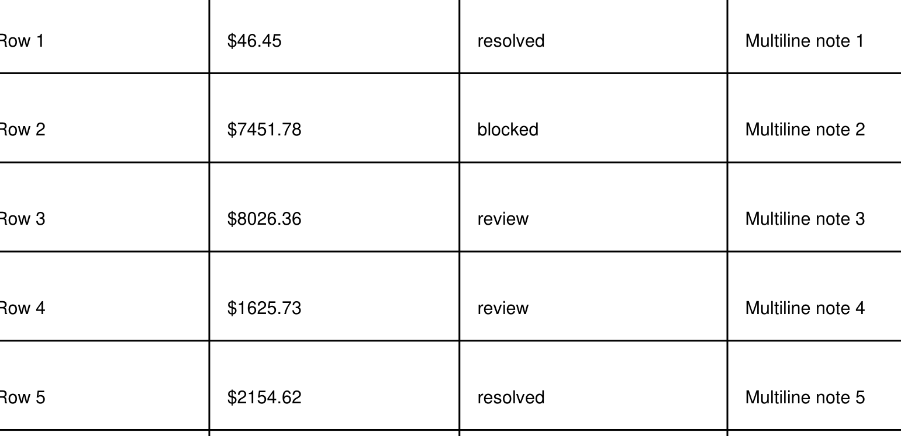

# PDF-005 complex table

<!-- Page 1 -->

## Page 1

### Extracted Text

### Complex Table Fixture

Grouped headers and merge-like layout simulation.

Footnote: merged-cell complexity expected.

| Group A |  | Group B |  |  |
| --- | --- | --- | --- | --- |
| Item | Value | Status | Notes |  |
| Row 1 | $46.45 | resolved | Multiline note 1 |  |
| Row 2 | $7451.78 | blocked | Multiline note 2 |  |
| Row 3 | $8026.36 | review | Multiline note 3 |  |
| Row 4 | $1625.73 | review | Multiline note 4 |  |
| Row 5 | $2154.62 | resolved | Multiline note 5 |  |
|  |  |  |  |  |

| Group A |  | Group B |  |  |
| --- | --- | --- | --- | --- |
| Item | Value | Status | Notes |  |
| Row 1 | $46.45 | resolved | Multiline note 1 |  |
| Row 2 | $7451.78 | blocked | Multiline note 2 |  |
| Row 3 | $8026.36 | review | Multiline note 3 |  |
| Row 4 | $1625.73 | review | Multiline note 4 |  |
| Row 5 | $2154.62 | resolved | Multiline note 5 |  |
|  |  |  |  |  |

