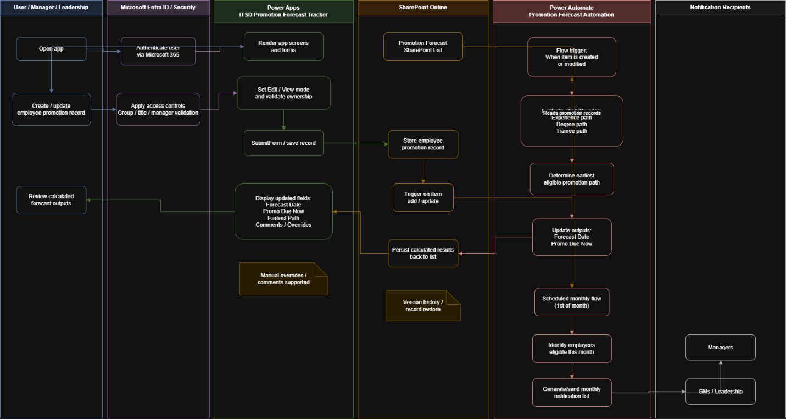
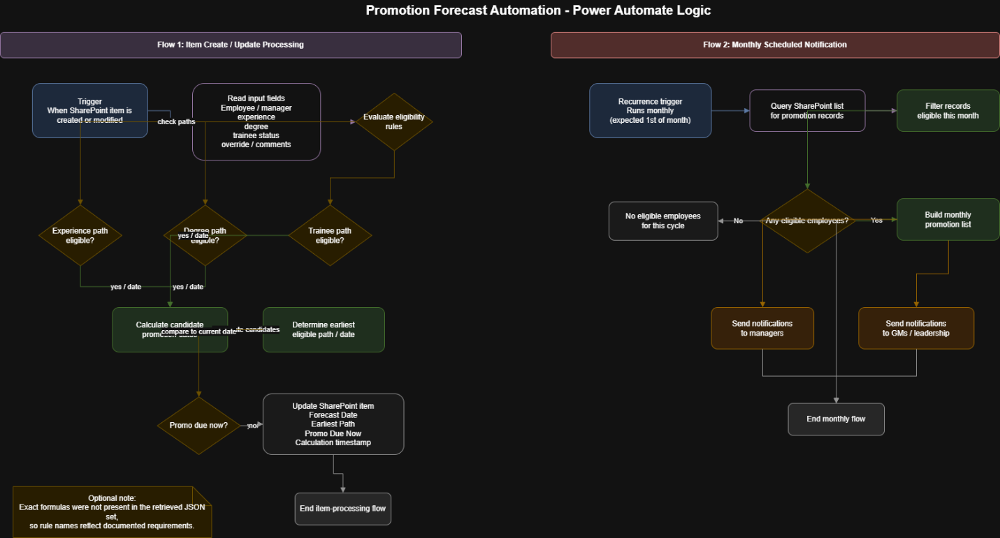

# Promotion Forecast Power App _2_

**Promotion Forecast Power App**

**Introduction – Why is this needed?**

The **Promotion Forecast Power App ** replaces a manually maintained Excel spreadsheet previously used by IT Service Desk leadership to track employee promotion eligibility, manager approvals, and override decisions. As an operationally owned application, it requires clear and standardized documentation to ensure continuity of support, reduce troubleshooting time, and allow seamless handoff between Service Desk engineers.

**1. Application Overview Documentation – “The Basics”**

**Application Description**

The Promotion Forecast Power App is a **Power Apps Canvas application ** backed by a SharePoint list. It enables managers and IT Service Desk leadership to:

View promotion eligibility data for Service Desk employees

Validate calculated eligibility dates

Apply manager-approved override dates when required

Capture justification comments for audit and review

The app improves data accuracy, access control, and process transparency compared to the prior Excel-based workflow.

**Ownership Details**

**Application Owner:** IT Service Desk Operations

**Primary Technical Owner:** Elliott Keskemety, IT Systems Engineer

**Primary QA Tester:** Crystal Croasmun, IT Qlty Assur Anly

**Business Stakeholders:** IT Service Desk Management

**Original Requestor:** Zakiya Middleton, IT Service Desk Manager

**Support Group:** IT Service Desk (Operations)

**Version Information**

**Application Type:** Power Apps Canvas App

**Current State:** MVP Complete

**Go live:** 6/26/26

**Sunset date:** 7/27/26

**Versioning format** – Automated by Power Apps

**Release Model:** Incremental updates as process requirements evolve

**Release Notes:** Maintained in ITSD documentation repository per version - [Release Notes - ITSD Power Apps.xlsx](https://progressiveinsurance.sharepoint.com/:x:/r/sites/ITSDOperations/Shared%20Documents/ITSD%20Ops%20Team%20Files/Tech%20Docs/Release%20Notes/Release%20Notes%20-%20ITSD%20Power%20Apps.xlsx?d=waab88117196041cdad608d4314b9f50a&csf=1&web=1&e=Sqmm1O)

**Dependencies**

SharePoint Online (primary data store)

Microsoft Power Apps

Power Automate (supporting automation/validation)

MS Entra ID (authentication)

Updates to job minimums via HR express

**2. Technical Architecture and Configuration**

**System Architecture**

**Frontend:** Power App: ITSD Promotion Forecast Tracker

**Backend:** SharePoint List – [Forecast Spreadsheet](https://progressiveinsurance.sharepoint.com/sites/ITSDFrontline/Lists/2026%20Forecast%20Spreadsheet/AllItems.aspx?sw=bypass&bypassReason=listStartSPFxError%3Berror%3DError%3A+Killswitches+are+not+initialized.+Killswitch+requeste%E2%80%A6)

**Replacing ***2026 Forecast Spreadsheet*

**Automation:** Power Automate flows for validation and downstream processing – Promotion Forecast Automation

Architecture diagrams should be maintained in Draw.IO format and stored alongside this document.

**Infrastructure Details**

Fully cloud-hosted (Microsoft 365)

No on-premise infrastructure dependencies

SharePoint Online provides data availability and resiliency

1. Data flow: Create/update record → SharePoint → Flow triggered → eligibility calculated → results written back → monthly notification process.

**Resiliency Details**

If SharePoint Online is unavailable, the application is read/write unavailable

Recovery supported via SharePoint and Power Apps version history for rollback.

No manual fallback process within the app (Excel maintained externally as contingency if needed)

**Configuration Settings**

Application variables control Edit/View modes and ownership validation

Save lifecycle explicitly controlled via Submit Form orchestration

Calculations for dates based on the min requirements for promotion as found in job description based approved by HR

Managers can override calculations at their discretion

**Integration Points**

Power Automate flow(s) triggered from Power Apps

No external APIs beyond Microsoft 365 services

**3. Access and Security Information**

**User Roles and Permissions**

Multi-layered authorization including group membership, title validation, and app-level manager validation.

**Read Access:** All authorized IT Service Desk and IT Service Desk Operations managers

**For access user must be member of security group P-U-ITSDCA-P and have one of the following titles:**

“it service desk manager",

"it group manager",

"it manager",

"it mgmt edge participant"

**Edit Access:** Restricted to the employee’s assigned manager

Manager validation is enforced **within the app logic written in screens and onstart code**, not solely via **P-U-ITSDCA-P Permissions**.

**Authentication Methods**

Authentication via **MS Entra ID** (Microsoft 365 sign-in)

No local credentials or alternate authentication methods

**Security and Access Procedures**

Access to app governed by M365 Security group membership and title

Access to SharePoint List governed by MS Group – ITSD Managers

PIMS / **P-U-ITSDCA-P** entitlement requirement.

**Audit Logs**

SharePoint version history tracks record changes

Power Automate run history available for troubleshooting

**4. Support and Maintenance Procedures**

**Incident Management**

Incidents tracked through standard ITSD processes \[pending\]

Escalate to IT Systems Engineering for application defects \[pending\]

**Maintenance Schedules**

No fixed maintenance window

Dependent on M365 platform availability

**Backup and Recovery**

SharePoint Online version history acts as primary recovery mechanism

Record-level restore available via SharePoint

Automated email from Power Automate if flow fails to owners of the app

**5. Troubleshooting and Knowledge Base**

**Known Issues**

The app uses multiple forms that must be submitted in the correct order, or data may not save properly

The comments field must be set up to allow multiple lines of text, or user input may not be saved or displayed correctly

Edit access failures: validate manager mapping

Save failures: confirm SharePoint list availability and flow health

UI issues: verify Power Apps published version

**Important Log Locations**

Power Automate flow run history

SharePoint list version history

**Diagnostic Tools**

Power Apps Monitor

Power Automate run diagnostics

**6. Change and Release Management**

**Change Requests**

Changes proposed

Through IT Service Desk Operations leadership

Fixes for issues or defects identified via testing or incident processes.

Reviewed prior to production deployment and tested before production release

**Release Notes**

Logged per update in ITSD documentation repository

**Testing Strategy / Workbook**

QA Tester: Crystal Croasmun

Smoke testing for:

Edit permissions

Save flow (main form + comments)

Override validation logic

**Rollback Procedures**

Revert to previous app version in Power Apps

Restore SharePoint data via version history if required

**7. Training and User Documentation**

**User Guides**

No user guide requested from customer as self-explanatory with limited user group.

**8. Compliance and Licensing**

**Compliance and Data Retention**

Contains internal employee eligibility data

Retention governed by HR minimum requirements policies

**Licensing Information**

Power Apps usage covered by Microsoft 365 premium licensing  thorugh the P-U-ITSDCA-P membership.

**Data Protection**

Data protected under Microsoft 365 security controls

No external data storage i

**Global Document Storage and Update Expectations**

**Storage Location**

ITSD Ops SharePoint (preferred)
